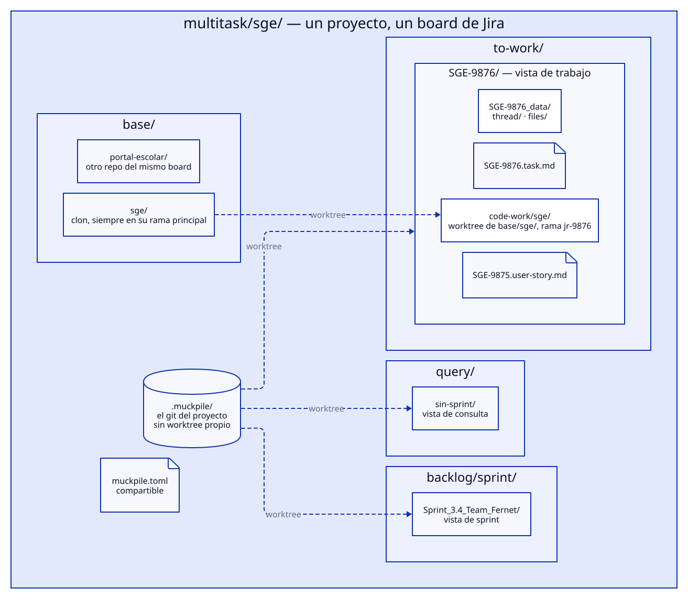
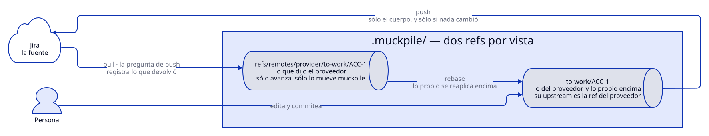
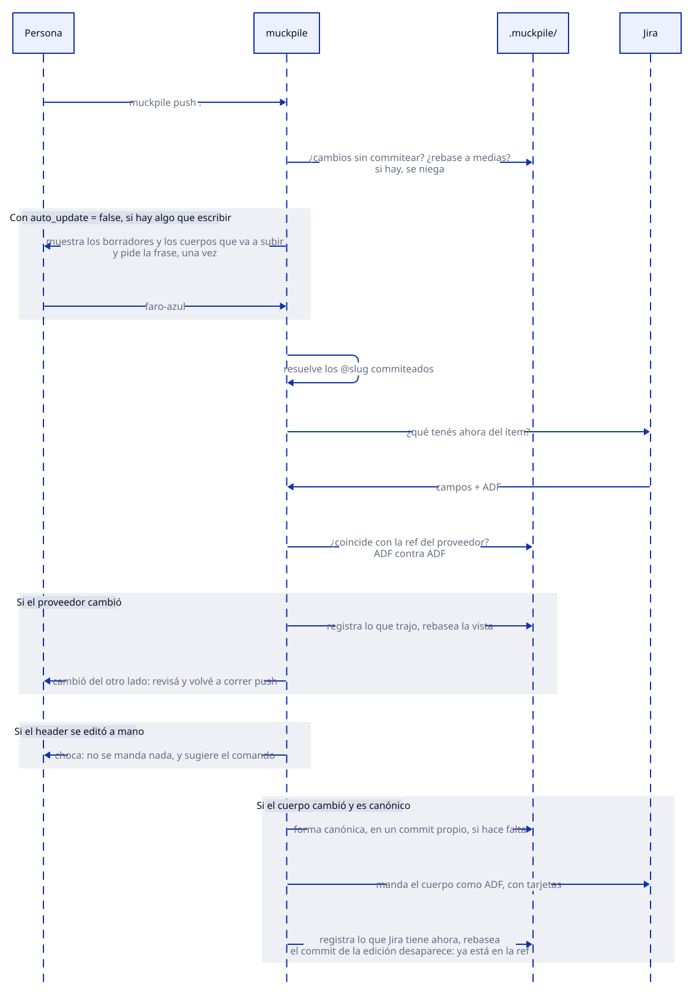
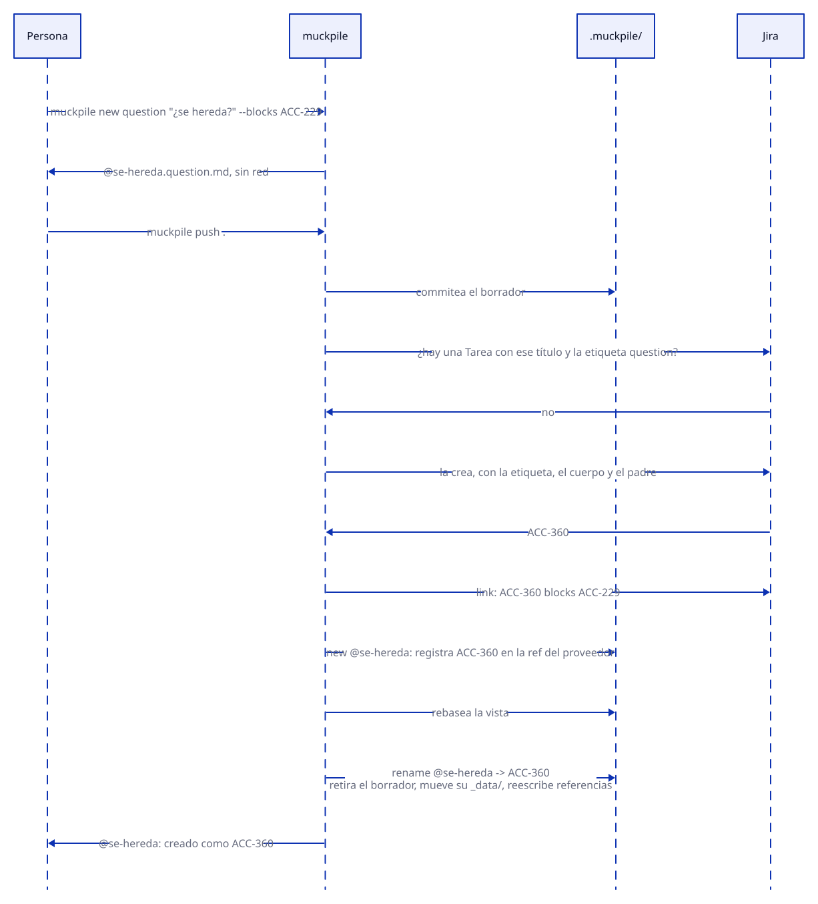
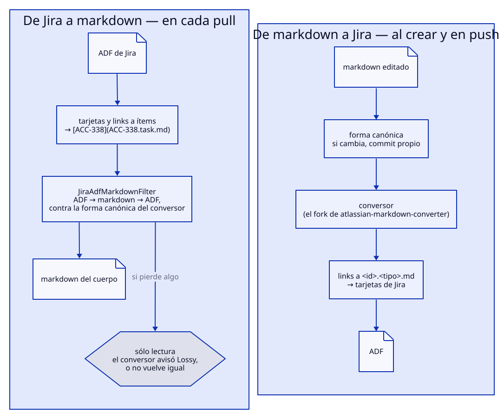
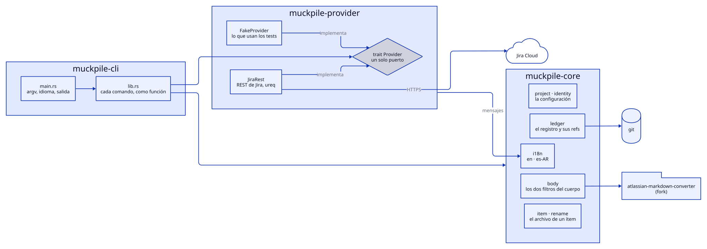

# muckpile

Los ítems de Jira como archivos markdown en git: una carpeta por contexto de trabajo, varios proyectos a la vez, y ni hooks ni servidor de por medio.

`muckpile` baja cada ítem —título, estado, padre, relaciones, cuerpo, comentarios y adjuntos— como un `<id>.<tipo>.md` con su carpeta `<id>_data/`, y lo sube de vuelta cuando es seguro. Git local es el registro de lo que dijo Jira: cada vista tiene una ref del proveedor que sólo avanza, y la vista se rebasea encima, con lo propio arriba. Reemplaza a `worklist`/`worklist-server`; el porqué y cada decisión están en [ADR-0001](docs/adr/0001-muckpile-nace-como-subsistema-propio.md).

- **Sin hooks ni servidor.** Un solo binario, que le habla a Jira en el momento en que corre el comando.
- **Multiproyecto.** Una carpeta por proyecto, y adentro, una vista por contexto: un ítem para trabajar, un sprint, una consulta.
- **Nada se pisa en silencio.** `push` vuelve a preguntar antes de escribir, compara el ADF contra el ADF, y si Jira cambió, registra lo que trajo y para.
- **El header cambia por comando; el cuerpo, como texto.** Un estado, un padre o una relación son operaciones de Jira, y cada una tiene su comando.
- **`question` desde el día uno.** Una pregunta que bloquea el cierre de otro ítem, con su hilo de comentarios y su carpeta de borradores.

---

## Contenido

- [Instalar](#instalar)
- [Primeros pasos](#primeros-pasos)
- [Un proyecto en disco](#un-proyecto-en-disco)
- [El registro: dos refs por vista](#el-registro-dos-refs-por-vista)
- [El archivo de un ítem](#el-archivo-de-un-ítem)
- [push](#push)
- [Borradores: el `@slug`](#borradores-el-slug)
- [El cuerpo: canonicidad y tarjetas](#el-cuerpo-canonicidad-y-tarjetas)
- [`question`, el hilo y los adjuntos](#question-el-hilo-y-los-adjuntos)
- [Configuración](#configuración)
- [Comandos](#comandos)
- [Arquitectura](#arquitectura)
- [Desarrollo](#desarrollo)

---

## Instalar

Hace falta Rust estable y git 2.31 o más nuevo.

```sh
cargo install --path crates/muckpile-cli     # deja `muckpile` en ~/.cargo/bin
```

O, sin instalar, `cargo build --release` y el binario queda en `target/release/muckpile`.

## Primeros pasos

**1. Quién sos, en esta máquina.** La cuenta de Jira y la variable de entorno donde vive el token van en `~/.config/muckpile/identity.toml` —nunca en un repo, y nunca el token mismo—:

```toml
[projects.acc]                         # el nombre de la carpeta del proyecto
jira_email = "persona@empresa.com"
jira_token_env = "JIRA_API_TOKEN"      # el nombre de la variable, no el valor
```

```sh
export JIRA_API_TOKEN=…                # un token de https://id.atlassian.com
export MUCKPILE_LANG=es-AR             # opcional: la salida en castellano
```

**2. Un proyecto.** Parado en la carpeta que junta todos los proyectos:

```sh
cd ~/multitask
muckpile init acc
```

Deja `acc/.muckpile/`, las carpetas reservadas y un `acc/muckpile.toml` para completar —la instancia de Jira, la clave del proyecto, el board, los tipos de ítem ([Configuración](#configuración))—.

**3. Trabajar un ítem.**

```sh
cd acc
muckpile to-work ACC-355               # la vista to-work/ACC-355/, con el ítem ya traído
cd to-work/ACC-355
muckpile pull ACC-339                  # suma a la vista un ítem relacionado
$EDITOR ACC-355.task.md                # se edita el cuerpo, como texto
git commit -am "el cuerpo, al día"     # push sube lo commiteado
muckpile push .
muckpile transition ACC-355 "Finalizada"
```

**4. Un sprint, o una consulta.**

```sh
muckpile sprint fetch                          # una vista vacía por sprint abierto
muckpile pull backlog/sprint/22_Las_vistas     # la vista queda con lo que el sprint tiene
muckpile pull query/sin-sprint                 # una consulta declarada en muckpile.toml
```

## Un proyecto en disco



La raíz de un proyecto tiene exactamente cuatro nombres reservados, y nada más vive ahí suelto: todo nombre que varía —una clave, un sprint, una consulta— está un nivel adentro de uno de ellos.

| Carpeta | Qué guarda |
|---|---|
| `.muckpile/` | El git del proyecto, sin worktree propio: el registro. Cada vista es un worktree suyo. |
| `base/<repo>/` | Un clon por repo del proyecto, siempre en su rama principal. Nunca se trabaja ahí. |
| `backlog/sprint/<sprint>/` | Una vista por sprint abierto, con el nombre que tiene en Jira. |
| `to-work/<id>/` | Una vista de trabajo: el ítem, lo relacionado, y `code-work/<repo>/` para el código. |
| `query/<nombre>/` | Una vista por consulta: lo que una consulta de `muckpile.toml` devuelve. |

`code-work/<repo>/` es un worktree de `base/<repo>/`, en la rama que sale de `commit_prefix` —`SGE-9876` con `commit_prefix = "jr"` da `jr-9876`—. Es de otro repo: el registro no lo ve, y `muckpile` no lo sincroniza.

## El registro: dos refs por vista



Cada vista tiene dos refs, con el nombre de la vista:

| Ref | Qué tiene | Quién la mueve |
|---|---|---|
| `refs/remotes/provider/<vista>` | Lo que dijo Jira, cada vez que se le preguntó: el markdown de cada ítem, su ADF tal cual en `.provider/<id>.adf.json`, el hilo y los adjuntos. | Sólo `muckpile`, y sólo con lo que devolvió la API. Va siempre para adelante. |
| `<vista>` | Lo que se ve y se edita: lo del proveedor, con lo propio encima. Su upstream es la ref del proveedor, así que `git status` dice solo cuánto está adelante y atrás. | Quien trabaja, y `muckpile`. |

- **`pull`** registra lo que trae en la ref del proveedor y rebasea la vista. Lo commiteado a mano se reaplica encima; si choca con lo que cambió en Jira, el rebase para y se resuelve con git.
- **`pull` y `push` se niegan** con cambios sin commitear o con un rebase a medias. Un borrador nuevo que nadie agregó no estorba.
- **Los commits los firma quien los hace.** Los de `muckpile` —en la ref del proveedor, un renombre, una forma canónica— van como `muckpile <muckpile@localhost>`; los tuyos, con tu identidad de git. Un `git log` dice qué trajo la herramienta y qué editó alguien.
- **Romper algo con git a mano no escribe nada mal en Jira.** Lo que `muckpile` guarda se vuelve a sacar con un `pull`; lo que no se subió lo cuida git —`git reflog`, o `git reset --hard @{u}` para volver a lo del proveedor—.

## El archivo de un ítem

```markdown
---
title: Vistas de trabajo, con su ítem y su _data/
status: En curso
parent: ACC-339
relation.blocks: [ACC-229]
relation.is_blocked_by: [ACC-340, ACC-341]
---
El cuerpo: la descripción del ítem, en markdown. Un link a otro ítem se
escribe [ACC-338](ACC-338.question.md).
```

- **El tipo va en el nombre del archivo** —`ACC-338.question.md` se distingue en un `ls`—, y sale del tipo de Jira por la tabla `item_type`.
- **El header es lo que Jira dice del ítem, y cambia sólo por comando:**

  | Campo | Comando |
  |---|---|
  | `title` | `muckpile title <id> "<título>"` |
  | `status` | `muckpile transition <id> <estado>` — el estado de Jira, literal, sin vocabulario propio |
  | `parent` | `muckpile parent <id> <padre>` |
  | `relation.*` | `muckpile link <a> <frase> <b>` · `muckpile unlink <a> <frase> <b>` |

  Si el header se edita a mano, `push` no manda ese ítem: dice qué campo difiere, sugiere el comando, y el archivo queda como está para verlo con `git diff`.
- **Las relaciones bajan todas, desde las dos puntas**, con la frase de Jira y `_` por espacio: la pregunta trae `relation.blocks: [ACC-229]` y ACC-229 trae `relation.is_blocked_by: [ACC-338]`. `link` y `unlink` aceptan la frase de las dos formas.
- **Después de escribir, cada comando pone la vista al día**, como un `pull` de ese ítem; si la vista tiene cambios sin commitear, lo dice y la deja atrás.
- **Un h1 es cuerpo**, como cualquier otra línea: el título es el campo `summary` de Jira, aparte.

## push



`push <vista>` primero resuelve los borradores, y después, por cada ítem con un cuerpo editado:

1. le pregunta a Jira qué tiene ahora, y lo compara contra la ref del proveedor —el ADF contra el ADF, que ve lo que el markdown no muestra—;
2. si Jira cambió, **no escribe**: registra lo que trajo, rebasea la vista y avisa, para revisar y volver a correr `push`;
3. si el header se editó a mano, choca y no manda nada del ítem;
4. si el cuerpo no es canónico, se niega y ofrece el diff contra el ADF real;
5. si todo está bien, manda el cuerpo, registra lo que Jira tiene después de escribir y rebasea: el commit de la edición desaparece, porque la ref ya tiene el mismo cambio, y la vista queda al día.

## Borradores: el `@slug`



`muckpile new <tipo> "<título>"` escribe `@<slug>.<tipo>.md` sin tocar la red —`--parent` y `--blocks` completan su header—. El siguiente `push` lo resuelve, en este orden:

1. busca un ítem con ese título y ese tipo —y esa etiqueta, si el tipo la lleva—, para que un reintento no duplique; sólo si no hay, lo crea, con el cuerpo, el padre y las relaciones del borrador;
2. registra en la ref del proveedor `new @slug` —o `found @slug`— con lo que devolvió Jira, y rebasea la vista;
3. recién ahí, el renombre como commit de la vista: se retira el borrador, `@slug_data/` pasa a `<id>_data/`, y se reescriben todas las referencias al `@slug`.

El orden importa: renombrar antes de rebasear haría que la vista y la ref escribieran el mismo archivo, y el rebase chocaría. Varios borradores que se nombran entre sí se resuelven en orden topológico; si uno falla, sólo frena a lo que depende de él.

## El cuerpo: canonicidad y tarjetas



Un cuerpo se puede editar local sólo si es **canónico**: si su ADF va a markdown y vuelve al mismo documento, comparado como JSON contra la forma canónica del conversor. Si el conversor avisa que sólo puede aproximar algo —una tabla con las filas numeradas, por ejemplo— el cuerpo es de sólo lectura, y `pull` lo dice en el momento en que lo baja.

- **La conversión** es la del fork de [`atlassian-markdown-converter`](https://github.com/anibalanto/atlassian-markdown-converter): lo que markdown no tiene —un panel, una mención, una imagen incrustada— viaja como ADF crudo y vuelve entero.
- **Antes de mandar un cuerpo**, si convertirlo cambia el texto —una negrita que se corta alrededor de un `code`—, el archivo se reescribe a esa forma en un commit propio: lo que se manda es lo que vuelve.
- **Un link a un ítem viaja como tarjeta de Jira**, la que muestra clave, título y estado: `[ACC-338](ACC-338.task.md)` sube como tarjeta, y una tarjeta —o un link a `…/browse/ACC-338`— baja como link al archivo, con el tipo que dice Jira.

## `question`, el hilo y los adjuntos

Una `question` (`<id>.question.md`) es una pregunta abierta que bloquea el cierre del ítem que nombra en `relation.blocks`. En un board sin tipo propio para preguntas, es una Tarea con la etiqueta `question`:

```sh
muckpile new question "¿el rol se hereda de la capa de arriba?" --blocks ACC-229
```

Cada ítem tiene al lado su carpeta `<id>_data/`:

- **`thread/`** — un archivo por comentario de Jira, `<id del comentario>.md`, con `author`, `author_id`, `created` e `in-reply-to` en el header. Las respuestas anidadas salen del `parentId` de Jira.
- **`files/`** — los adjuntos, bajados, y los borradores locales que todavía no se decidieron.

Se escriben con comandos. **Todo comentario dice quién lo escribió:**

```sh
muckpile comment ACC-338 respuesta.md --reply-to 42180 --ai claude-opus-5
muckpile comment ACC-338 nota.md --i-human
muckpile attach ACC-338 medicion.png
```

`--ai <modelo>` pone `ai: <modelo>` al principio del comentario —y `pull` lo devuelve al header—. `--i-human` pide que una persona escriba en la terminal una frase distinta cada vez, `faro-azul`, `puma-veloz`: sin terminal, se niega. Sin ninguno de los dos, `comment` no manda nada.

## Configuración

`<proyecto>/muckpile.toml` es compartible: nada de lo que tiene es de una persona.

```toml
provider = "jira-rest"
jira_base_url = "https://lamansys.atlassian.net"
jira_project_key = "SGE"
jira_board_id = 12                      # para sprint fetch y pull de un sprint
commit_prefix = "jr"                    # nombra la rama de code-work: SGE-9876 -> jr-9876

[repos.sge]
remote = "git@gitlab.lamansys.ar:minsal/sge.git"
branch = "master"

[item_type]                             # tipo de muckpile -> tipo de Jira
task = "Tarea"
user-story = "Historia"
epic = "Epic"
question = { type = "Tarea", label = "question" }   # un tipo compartido se distingue por una etiqueta

[queries]                               # lo que trae `pull query/<nombre>`
sin-sprint = "project = SGE AND sprint is empty"
```

- Entre los tipos que comparten un tipo de Jira, uno solo puede ir sin etiqueta; si la tabla es ambigua, el archivo no se carga.
- `~/.config/muckpile/identity.toml` es de cada máquina ([Primeros pasos](#primeros-pasos)).
- El idioma de la salida sale de `MUCKPILE_LANG` (`en` o `es-AR`), o del locale del sistema: uno que empiece con `es` es `es-AR`, cualquier otro `en`.

## Comandos

| Comando | Qué hace |
|---|---|
| `init <proyecto>` | Crea un proyecto: `.muckpile/`, `muckpile.toml` para completar, y las cuatro carpetas. Es el único que crea un registro. |
| `to-work <id> [--empty]` | Abre `to-work/<id>/` y trae el ítem. Sólo en la raíz del proyecto. |
| `pull [<id>]` | En una vista de trabajo: trae su ítem, o suma uno relacionado. Dice en qué otras vistas de esta máquina está cada ítem. |
| `pull backlog/sprint/<sprint>` | Deja la vista con exactamente lo que el sprint tiene: lo que entró viene, lo que salió se va. |
| `pull query/<nombre> [--query <JQL>]` | Lo mismo con una consulta: la de `muckpile.toml`, o la de `--query` para ese `pull`. |
| `sprint fetch` | Una vista vacía por sprint abierto; nunca borra una con algo adentro. |
| `push <vista>` | Resuelve los borradores y sube los cuerpos editados, si nada cambió en Jira. |
| `status <vista>` | Compara lo local contra Jira, sin escribir. |
| `list <vista> [--state <e>] [--category <c>] [--parent <id>]` | Los ítems de una vista, filtrados. |
| `show <id> [--local]` | Un ítem, de Jira en vivo o de la copia local, y su `_data/`. |
| `new <tipo> <título> [--parent <id>] [--blocks <id>]` | Un borrador `@slug`, sin red. |
| `title <id> <título>` | Cambia el título. |
| `transition <id> <estado>` | Busca la transición que lleva a ese estado, y la aplica. |
| `parent <id> <padre>` | Cambia el padre. |
| `link <a> <frase> <b>` · `unlink <a> <frase> <b>` | Crea o quita una relación, con la frase de Jira (`blocks`, `is blocked by`, `relates to`…). |
| `comment <id> <archivo> [--reply-to <id>] (--ai <modelo> \| --i-human)` | Manda un comentario. |
| `attach <id> <archivo>` | Sube un adjunto. |
| `states discover` | Lista los estados del workflow con su categoría, y los guarda en `<proyecto>.states.toml` para `list --category`. |
| `code-work add <repo> [--from <rama>] [--branch <rama>]` | Agrega `code-work/<repo>/` a la vista de trabajo donde estás. |

## Arquitectura



| Crate | Qué tiene |
|---|---|
| `muckpile-cli` | El binario. `main.rs` sólo lee argumentos, elige el idioma e imprime; cada comando es una función de `lib.rs`, probada por separado. |
| `muckpile-core` | Lo que no depende del proveedor: el registro (`ledger`), los filtros del cuerpo (`body`), el archivo de un ítem y el renombre, la configuración, los mensajes (`i18n`). |
| `muckpile-provider` | Un solo puerto, `trait Provider`, con dos implementaciones: `JiraRest` —la REST de Jira, con `ureq`— y `FakeProvider`, la que usan los tests. Un `muckpile-server` podría implementar el mismo puerto sin que el resto lo note. |

## Desarrollo

```sh
cargo test                       # la suite completa
cargo clippy --all-targets       # tiene que salir limpio
```

- **La suite nunca le habla a Jira.** Corre contra `FakeProvider` y contra un servidor HTTP local que responde lo que el test le da; lo que se sabe de la API real está medido a mano, contra el board de `ACC`, y dicho en los tests y en el ADR.
- **TDD:** el test va antes que el código.
- **El código va en inglés entero**, identificadores y comentarios; un comentario dice por qué el código es así en términos del código, nunca señalando un documento.
- **Los mensajes** viven en `crates/muckpile-core/i18n/en.toml` y `es-AR.toml`, con las mismas claves —un test lo exige—.
- **La spec manda.** Cada decisión de [ADR-0001](docs/adr/0001-muckpile-nace-como-subsistema-propio.md) está atada al código que la implementa con `bilinker`, la herramienta de accreta para eso: se toca la spec, `bilinker check .` señala el código que quedó atrás, se cambia y se acepta.
- **Los diagramas** son fuentes [D2](https://d2lang.com) en `docs/diagrams/`. Para regenerar uno:

  ```sh
  d2 --layout elk --theme 0 --dark-theme 200 --pad 20 docs/diagrams/push.d2 docs/diagrams/push.svg
  ```

## Licencia

MIT o Apache-2.0, a elección.
